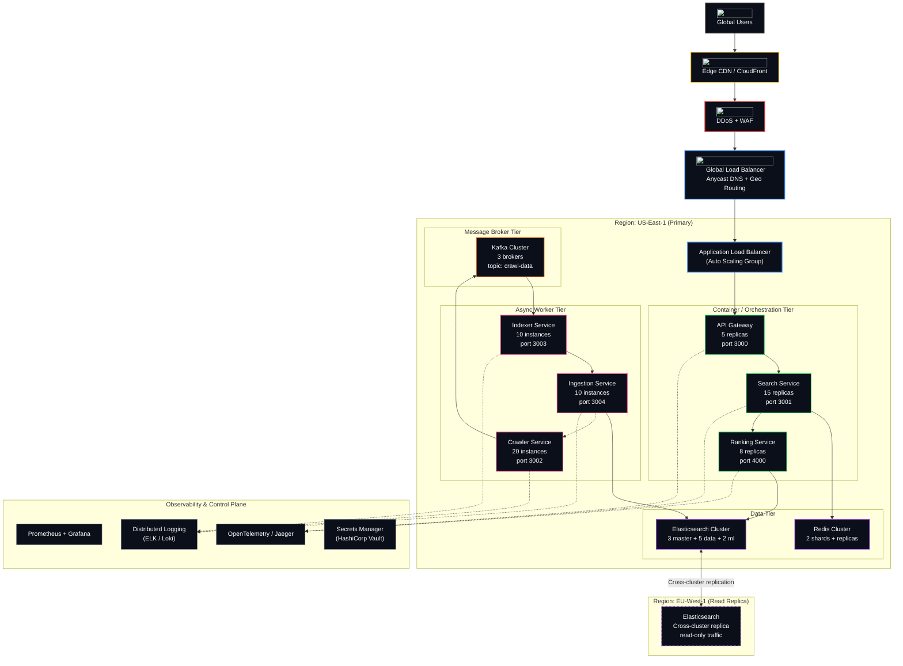

# SKYSEARCH

Distributed search engine built on a microservices architecture with AI-assisted insights. SKYSEARCH combines scalable information retrieval, real-time indexing, and modern frontend engineering to deliver fast, relevant search results.

## Table of Contents

- [Project Context](#project-context)
- [System Design at Scale](#system-design-at-scale)
- [Data Pipeline](#data-pipeline)
- [Tech Stack](#tech-stack)
- [Repository Structure](#repository-structure)
- [Services Breakdown](#services-breakdown)
- [API Reference](#api-reference)
- [Ranking and Relevance](#ranking-and-relevance)
- [Security and Performance](#security-and-performance)
- [Development Setup](#development-setup)
- [Docker Deployment](#docker-deployment)
- [Roadmap](#roadmap)
- [Contribution Guidelines](#contribution-guidelines)
- [License](#license)

## Project Context

SKYSEARCH is a production-oriented distributed search system. It ingests web content, indexes it, and serves ranked results through a unified API. An AI insight layer summarizes search results and enables conversational follow-up, all delivered through a responsive React frontend.

Key characteristics:

- Microservices decomposition for independent scaling and deployment
- Event-driven ingestion via Kafka for real-time indexing
- Full-text search backed by Elasticsearch
- BM25 ranking with freshness and link-based boost
- Rate limiting, caching, and request tracing in the gateway tier
- AI-assisted result summarization and follow-up Q&A

## System Design at Scale

The following diagram represents the production-grade deployment topology required to serve billions of users. The system is organized into distinct zones: user access, edge protection, application tier, data tier, message bus, async worker tier, observability, and geo-redundancy.



### User Flow

1. Request enters via CDN and passes through WAF and DDoS protection.
2. Global Load Balancer routes traffic to the nearest healthy region using Anycast DNS.
3. Application Load Balancer distributes requests across API Gateway replicas.
4. API Gateway applies rate limiting, auth, and request tracing, then proxies to Search Service.
5. Search Service checks Redis for cached results; on miss, it orchestrates a ranking pipeline.
6. Ranking Service queries Elasticsearch, computes BM25 + freshness + link boost, and returns ranked documents.
7. Search Service caches the result in Redis, emits analytics to Kafka, and returns the response.
8. Frontend renders the results and asynchronously requests an AI summary from the gateway.

### Deployment Considerations for Billions of Users

- **Regions:** Deploy to at least 3 geo-distributed regions (e.g., us-east-1, eu-west-1, ap-southeast-1) with Active-Active or Active-Passive failover.
- **Frontend:** Host static assets on a multi-region CDN (CloudFront / Cloudflare) with edge caching for HTML shells and static JS bundles.
- **Gateway:** Run API Gateway behind an ALB with auto-scaling policies on CPU, network, and request latency.
- **Search Service:** Partition by query type or query hash; use consistent hashing to route queries to esoteric shards when scaling beyond a single cluster.
- **Elasticsearch:** Use a dedicated master-eligible node set, hot-warm architecture, and Cross-Cluster Replication (CCR) for DR.
- **Kafka:** Run a multi-replica cluster with rack-aware producer configuration and ISR-based durability guarantees.
- **Redis:** Use Redis Cluster with at least 3 shards, each with 1 replica, and enable cluster mode for horizontal scaling.

### Failure Domains

- Failure of a single Redis shard degrades cache hit rate but does not block search.
- Elasticsearch node failures are handled by replica shard promotion within seconds.
- Crawler and indexer workers are stateless; any instance can fail and be replaced without coordination.
- Kafka ensures at-least-once delivery; indexer is idempotent by document ID.
- The gateway tier is fully redundant; losing any replica causes zero downtime because the ALB redistributes traffic.

## Data Pipeline

### Ingestion path

1. **Crawler** fetches web pages, extracts content, and publishes structured records to the `crawl-data` Kafka topic.
2. **Ingestion Service** reads from Kafka, validates and normalizes payloads, then republishes to an internal indexing topic.
3. **Indexer Service** consumes the normalized topic, enriches documents, and indexes them into Elasticsearch.

### Query path

1. User submits a query via the frontend.
2. **API Gateway** validates the request and applies rate limiting.
3. **Search Service** retrieves candidate documents from **Elasticsearch**.
4. **Ranking Service** applies BM25 scoring, freshness decay, and link authority to produce a ranked list.
5. **API Gateway** returns the ranked results to the client.
6. Frontend renders the results and asynchronously requests an AI summary from the gateway.

## Tech Stack

### Frontend

- React 19 with Vite 8
- Tailwind CSS 4
- React Router 7
- Zustand for client state
- TanStack Query for server state
- Axios for HTTP communication

### Backend

- Node.js with Express
- `dotenv` for configuration management
- Axios for outbound HTTP
- Jest-compatible built-in test runner (`node --test`)

### Infrastructure and tools

- Kafka for event streaming
- Redis for caching and rate limiting
- Elasticsearch 8 for inverted indexing and full-text search
- Docker and Docker Compose for local orchestration
- Nodemon for development watch mode

## Repository Structure

```
skysearch/
  frontend/                        # React client application
    src/
      components/                  # Reusable UI components
      pages/                       # Route-level pages (Home, Search, Images)
      services/api/                # API client layer
      store/                       # Zustand state stores
      utils/                       # Shared utilities
    package.json

  engine/                          # Backend services and infrastructure
    services/
      crawler-service/             # Web crawler worker
      ingestion-service/           # Kafka ingestion worker
      indexer-service/             # Elasticsearch indexing worker
      search-service/              # Search orchestration and caching
      ranking-service/             # Document scoring and ranking
      gateway-service/             # API gateway, auth, and routing
    infra/
      docker/                      # Dockerfiles for each service

  docker-compose.yml               # Infrastructure orchestration
```

Each backend service is self-contained with its own dependencies and configuration but shares common dependency versions and repository conventions.

## Services Breakdown

### crawler-service

- Discovers and fetches web pages.
- Normalizes raw HTML into structured content.
- Publishes crawl records to Kafka (`crawl-data` topic).
- Runs as a long-lived worker.

### ingestion-service

- Consumes raw crawl events from Kafka.
- Validates schema and sanitizes payloads.
- Republishes normalized documents for indexing.
- Acts as a backpressure and validation layer between ingestion and indexing.

### indexer-service

- Consumes normalized documents from Kafka.
- Builds or updates Elasticsearch documents.
- Handles mapping and index lifecycle.
- Commits documents in batches for throughput.

### ranking-service

- Accepts candidate document sets from search-service.
- Computes relevance scores using BM25 term frequency and inverse document frequency.
- Applies freshness decay to favor recent content.
- Applies link-based authority boost where link graph data is available.
- Sorts and returns ranked results with scores.

### search-service

- Handles query parsing, validation, and parameter normalization.
- Queries Elasticsearch for candidate documents.
- Integrates with Redis for query result caching.
- Coordinates with ranking-service for post-retrieval scoring.
- Records analytics and request metadata.
- Manages pagination and result size constraints.

### gateway-service

- Single entry point for client traffic.
- Applies request ID tracing for observability.
- Enforces rate limiting per client.
- Validates input and sanitizes outputs.
- Proxies requests to downstream services.
- Applies CORS and security headers.
- Exposes AI summary and AI follow-up endpoints.

## API Reference

### Health

```
GET /health
Response: 200 OK
{
  "status": "ok"
}
```

### Search

```
GET /search
Query Parameters:
  q       (string, required)  Search query
  page    (integer, optional) Page number, default 1
  size    (integer, optional) Results per page, default 10, max 50
  filters (object, optional)  Key-value filters

Example:
GET /search?q=why&page=1&size=10
```

Sample response:

```json
{
  "total": 120,
  "page": 1,
  "size": 10,
  "totalPages": 12,
  "results": [
    {
      "id": "https://example.com/article",
      "title": "Article Title",
      "description": "Snippet of the article content...",
      "url": "https://example.com/article",
      "source": "example",
      "score": 1.42
    }
  ]
}
```

### AI Summary

```
POST /ai/summary
Request body:
{
  "query": "why",
  "results": [
    {
      "title": "stackoverflow.com",
      "description": "serving a file from a service worker...",
      "url": "https://stackoverflow.com"
    }
  ]
}

Response:
{
  "summary": "A concise summary of the top results."
}
```

The AI summary endpoint accepts up to five results and returns a two to three sentence summary grounded in the provided content. If the AI provider is unavailable, the gateway returns a fallback message.

## Ranking and Relevance

The ranking pipeline computes a final score for each candidate document using multiple signals:

- **BM25 score:** Term frequency and inverse document frequency over the indexed corpus. This is the primary relevance signal.
- **Freshness boost:** Newer documents receive a higher score relative to older content. The decay function is configurable and can be tuned to the content vertical.
- **Link authority:** Where inbound link data is indexed, documents with stronger inbound references receive an additional boost.
- **Field weighting:** Title and heading matches are weighted higher than body text matches.

The ranking service returns results sorted by descending final score.

## Security and Performance

### Security

- All internal requests are authenticated via API key middleware in the gateway.
- Express-level request validation rejects malformed payloads before they reach business logic.
- CORS is configured to allow only known frontend origins.
- Helmet is enabled for standard HTTP security headers.

### Performance

- Redis cache stores hot query results with a configurable TTL to reduce Elasticsearch load.
- Rate limiting is enforced per client window to protect downstream services.
- Request IDs are propagated through the gateway for distributed tracing.
- Elasticsearch search timeouts and retries are configured per service to fail fast under pressure.
- Request compression is enabled at the gateway tier.

## Development Setup

### Prerequisites

- Node.js 18 or later
- Docker and Docker Compose
- Redis 7
- Elasticsearch 8
- Kafka 7

### Installation

1. Clone the repository:

```bash
git clone https://github.com/your-org/skysearch.git
cd skysearch
```

2. Install frontend dependencies:

```bash
cd frontend
npm install
```

3. Install backend service dependencies. Each service under `engine/services/<service-name>` has its own `package.json`. Install dependencies for each service:

```bash
cd engine/services/gateway-service && npm install
cd engine/services/search-service && npm install
cd engine/services/ranking-service && npm install
cd engine/services/crawler-service && npm install
cd engine/services/indexer-service && npm install
cd engine/services/ingestion-service && npm install
```

### Environment variables

Copy and edit `.env` files in each service directory. Key variables include:

- `PORT`: Service port
- `CORS_ORIGIN`: Allowed origins
- `REDIS_URL`: Redis connection string
- `ELASTIC_NODE`: Elasticsearch HTTP endpoint
- `KAFKA_BROKERS`: Kafka bootstrap servers
- `SEARCH_SERVICE_URL`: Upstream search service URL (gateway)
- `RANKING_SERVICE_URL`: Upstream ranking service URL (search)
- `RATE_LIMIT_WINDOW_MS` and `RATE_LIMIT_MAX_REQUESTS`: Gateway throttling parameters
- `API_KEY`: Shared API key for inter-service auth

### Running services

Development mode (with auto-reload):

```bash
# Terminal 1 - Gateway
cd engine/services/gateway-service && npm run dev

# Terminal 2 - Search service
cd engine/services/search-service && npm run dev

# Terminal 3 - Ranking service
cd engine/services/ranking-service && npm run dev

# Terminal 4 - Crawler service
cd engine/services/crawler-service && npm run dev

# Terminal 5 - Indexer service
cd engine/services/indexer-service && npm run dev

# Terminal 6 - Ingestion service
cd engine/services/ingestion-service && npm run dev
```

Frontend:

```bash
cd frontend
npm run dev
```

Production mode:

```bash
cd engine/services/<service-name>
npm start
```

## Docker Deployment

Start the full stack with Docker Compose. This command launches Kafka, Redis, Elasticsearch, and the backend services with their preconfigured networking, environment variables, and health dependencies.

```bash
docker compose up --build
```

Individual service access after startup:

- Frontend: `http://localhost:5173`
- API Gateway: `http://localhost:3000`
- Search Service: `http://localhost:3001`
- Ranking Service: `http://localhost:4000`
- Crawler Service: `http://localhost:3002`
- Indexer Service: `http://localhost:3003`
- Ingestion Service: `http://localhost:3004`
- Elasticsearch: `http://localhost:9200`
- Redis: `localhost:6379`
- Kafka: `localhost:9092`

Shutdown:

```bash
docker compose down
```

Volumes persist between restarts for Elasticsearch and Kafka. To reset state, add `-v` to the down command.

## Roadmap

- Query parser with field-specific search (`inurl`, `intitle`, `site`)
- Advanced filters by content type, date range, and language
- ML-based ranking models (learning-to-rank) alongside BM25
- Personalized result ranking based on user history
- Query suggestions and autocomplete
- Image and video search integration
- Distributed tracing integration (OpenTelemetry)
- Horizontal scaling with Kubernetes manifests

## Production Topology Note

For traffic patterns in the billions of queries per month range, the canonical deployment adds:

- A managed API gateway (AWS API Gateway / Cloudflare Workers) in front of the compute-tier gateways to absorb static caching and edge-side personalization.
- A dedicated VPC peering mesh between services with security groups and private DNS.
- A hot-warm Elasticsearch cluster with ILM policies, force-merge schedules, and dedicated coordinating nodes.
- A Kafka cluster with rack-aware producer acks, increased replica factor, and monitoring for under-replicated partitions.
- A read replica domain for ranking reads, plus a separate Analytics Kafka topic consumed by external BI tools.

The Mermaid source for this architecture is available at [`docs/system-design.mmd`](docs/system-design.mmd).

## Contribution Guidelines

Contributions are accepted through pull requests.

### Code standards

- Follow the existing service structure and naming conventions.
- Keep services independently deployable.
- Add or update unit and integration tests for changed behavior.
- Use descriptive commit messages in the present tense.

### Pull request checklist

- Ensure tests pass in the modified service.
- Update this README if the public API or deployment steps change.
- Confirm Docker Compose still starts cleanly.

### Reporting issues

Use the issue tracker to report bugs or propose features. Include reproduction steps, service logs, and environment details.

## License

SKYSEARCH is released under the MIT License. See the LICENSE file in the root of the repository for the full text.
